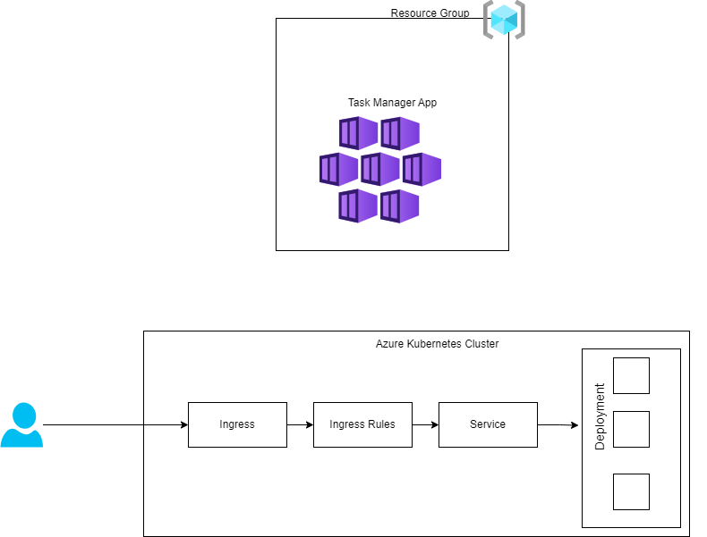
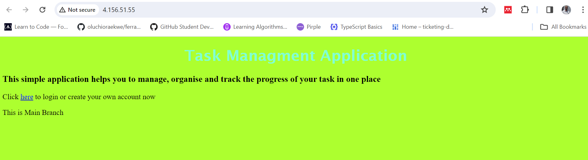

# Task Mangement Application

This is a task mangement application that can be used to manage users tasks. The application written in NodeJs and containerized using docker.

## Architecture
The architecture of this application is very simple. It is simple web application. Sequelite was used as an in memory database in order to maintain the simplicity of the application. It is containerized with docker and deployed in a kubernetes cluster
## Kubernetes Structure
    The sumarry of the kubernetes service is outlined below
    1. Deployment is used to managed the pods
    2. Deploment uses Horizontal Pods Autoscalling to manage the replica sets
    3. Service of type clusterIp is user to route traffic to the Deployment
    4. Ingress Controller with path based routing is used to expose the service to a public Ip

## Terraform diagram
    Terraform is used for the infrastructre provisioning. It has one module for the AKS resource

## Architecture diagram

    

  

# Deployment
The application has automation pipelines to deploys it to Azure Kubernetes Service. First the infrastructure which is written in Terraform will be deployed in Azure, While the infrastructure is deploying a parrallel job that containerizes the application and pushes it to github also runs. After the two Jobs must have been completed then the deployment of the image to Azure AKS now takes place

# Running The application
## Steps to Run The application
    1. Clone the repository from https://github.com/oluchioraekwe/taskmanager.git 
    2. Run npm intall to install the dependencies
    3. Run npm build to compile the typescript files
    4. Run npm start to start the app.
You can also run it as a container with the following steps
    1. make sure your docker is running
    2. Run docker compose up --build to start up the application
    3. Run docker compose down to shutdown the application
When you application is up and running you can localhost:4500 to view you app
## Homepage

    

  

## Steps to deploy the infrastructure
    1. Clone the repository from https://github.com/oluchioraekwe/taskmanager.git 
    2. Change to the infrastructure directory
    3. Run terrform init
    4. Run terraform apply -auto-approve
 
